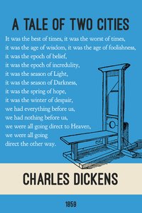

# First line book covers
Visual design project to create small posters with the first line of a book.

### Examples
  

### Notes
  
+ Ready to print PDF copies for each design can be found [here](/pdf).
+ Print on 11x17 Carolina Cardstock (CC), set scaling to shrink to print area.
+ Additional first lines on [wikiqutoes](https://en.wikiquote.org/wiki/Opening_lines).

### Attribution

Fonts from [The League of Moveable Type](https://www.theleagueofmoveabletype.com/)
  + [Ostrich Sans bold](https://www.theleagueofmoveabletype.com/ostrich-sans)
  + [Goudy Bookletter 1911](https://www.theleagueofmoveabletype.com/goudy-bookletter-1911)
  
Diver helmet by Boston-Joe, [Mark V](http://boston-joe.deviantart.com/art/mark-v-120296499)