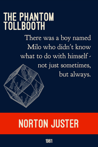

# Ex Libris
_Out of the books to create art._

  
This is an open project to design and disseminate posters of famous books with the first line.
The baseline posters should have a consistent style and designed in the open-source photo/layout tool [GIMP](https://www.gimp.org/) so they can be remixed and shared.
  

### Notes
  
+ Ready to print copies for each design can be found in [PDF](/pdf) or [PNG](/png).
+ Print on 11x17 Carolina Cardstock (CC), set scaling to shrink to print area.
+ Source files (created in GIMP) can be found in [XCF](/source).
+ Additional first lines on [wikiqutoes](https://en.wikiquote.org/wiki/Opening_lines).
  
### License 
  
[Creative Commons Share-alike 4.0](LICENSE). You are free to copy and redistribute the material (in any medium or format) and adapt (remix, transform, and build upon the material for any purpose), even commercially as long as you give credit to this repository or author. Additionally you must ShareAlike: if you remix, transform, or build upon the material, you must distribute your contributions under the same license as the original.

TLDR; _Go nuts, and give props!_

### Attribution

Fonts from [The League of Moveable Type](https://www.theleagueofmoveabletype.com/)
  + [Ostrich Sans bold](https://www.theleagueofmoveabletype.com/ostrich-sans)
  + [Goudy Bookletter 1911](https://www.theleagueofmoveabletype.com/goudy-bookletter-1911)
  
Diver helmet by Boston-Joe, [Mark V](http://boston-joe.deviantart.com/art/mark-v-120296499)

Madeline colors inspired from [Veerle's blog](http://veerle.duoh.com/inspiration/detail/candarel).

### Potential new covers

  + Once on a dark winter’s day, when the yellow fog hung so thick and heavy in the streets of London that the lamps were lighted and the shop windows blazed with gas as they do at night, an odd- looking little girl sat in a cab with her father and was driven rather slowly through the big thoroughfares. The Little Princes, Frances Hodgson Burnett
  + Many years later, as he faced the firing squad, Colonel Aureliano Buendía was to remember that distant afternoon when his father took him to discover ice. Gabriel García Márquez 1967, Muchos años después, frente al pelotón de fusilamiento, el coronel Aureliano Buendía había de recordar aquella tarde remota en que su padre lo llevó a conocer el hielo.
  + This story begins within the walls of a castle, with the birth of a mouse. The Tale of Despereaux, Kate DiCamillo
  + Once, in a house on Egypt Street, there lived a rabbit who was made almost entirely of china. Miraculous Journey of Edward Tulane, Kate DiCamillo
  + There was once a sweet little maid, much beloved by everybody, but most of all by her grandmother, who never knew how to make enough of her. Brothers Grimm, 1812
  + It was a pleasure to burn. Fahrenheit 451, Ray Bradbury
  + Not far from where I live there is a queer old empty wooden house standing all by itself on the side of the road. The Giraffe and the Pelly and Me, Roald Dahl
  + Where’s Papa going with that ax? said Fern to her mother as they were setting the table for breakfast. Charlotte’s Web
  + In the light of the moon a little egg lay on a leaf. The Very Hungry Caterpillar by Eric Carle
  + "Nancy Drew, an attractive girl of eighteen, was driving home along a country road in her new, dark-blue convertible." Nancy Drew: The Secret of the Old Clock, Carolyn Keene 

### Developer Notes

Use the [`Makefile`](Makefile) to ensure all subfiles have been generated from the XCF source.

Need to use the BFG to reduce the old binaries file size?

    git clone --mirror https://github.com/thoppe/ex-libris
    java -jar bfg-1.12.13.jar --delete-files '*.{png,pdf,xcf}' ex-libris.git
    cd ex-libris.git
    git reflog expire --expire=now --all && git gc --prune=now --aggressive
    git push

