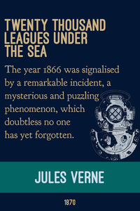

# First line book covers
Visual design project to create small posters with the first line of a book.

### Examples
  

  

### Notes
  
+ Ready to print copies for each design can be found in [PDF](/pdf) or [PNG](/png).
+ Print on 11x17 Carolina Cardstock (CC), set scaling to shrink to print area.
+ Source files (created in GIMP) can be found here [XCF](/source).
+ Additional first lines on [wikiqutoes](https://en.wikiquote.org/wiki/Opening_lines).

### Attribution

Fonts from [The League of Moveable Type](https://www.theleagueofmoveabletype.com/)
  + [Ostrich Sans bold](https://www.theleagueofmoveabletype.com/ostrich-sans)
  + [Goudy Bookletter 1911](https://www.theleagueofmoveabletype.com/goudy-bookletter-1911)
  
Diver helmet by Boston-Joe, [Mark V](http://boston-joe.deviantart.com/art/mark-v-120296499)

Madeline colors inspired from [Veerle's blog](http://veerle.duoh.com/inspiration/detail/candarel).

### Potential new covers

  + Once on a dark winter’s day, when the yellow fog hung so thick and heavy in the streets of London that the lamps were lighted and the shop windows blazed with gas as they do at night, an odd- looking little girl sat in a cab with her father and was driven rather slowly through the big thoroughfares. The Little Princes, Frances Hodgson Burnett
  + Many years later, as he faced the firing squad, Colonel Aureliano Buendía was to remember that distant afternoon when his father took him to discover ice. Gabriel García Márquez 1967, Muchos años después, frente al pelotón de fusilamiento, el coronel Aureliano Buendía había de recordar aquella tarde remota en que su padre lo llevó a conocer el hielo.
  + This story begins within the walls of a castle, with the birth of a mouse. The Tale of Despereaux, Kate DiCamillo
  + Once, in a house on Egypt Street, there lived a rabbit who was made almost entirely of china. Miraculous Journey of Edward Tulane, Kate DiCamillo
  + There was once a sweet little maid, much beloved by everybody, but most of all by her grandmother, who never knew how to make enough of her. Brothers Grimm, 1812
  + It was a pleasure to burn. Fahrenheit 451, Ray Bradbury
  + Not far from where I live there is a queer old empty wooden house standing all by itself on the side of the road. The Giraffe and the Pelly and Me, Roald Dahl
  + Where’s Papa going with that ax? said Fern to her mother as they were setting the table for breakfast. Charlotte’s Web
  + In the light of the moon a little egg lay on a leaf. The Very Hungry Caterpillar by Eric Carle
  + "Nancy Drew, an attractive girl of eighteen, was driving home along a country road in her new, dark-blue convertible." Nancy Drew: The Secret of the Old Clock, Carolyn Keene 

