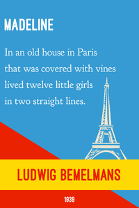

# First line book covers
Visual design project to create small posters with the first line of a book.

### Examples
  

  

### Notes
  
+ Ready to print copies for each design can be found in [PDF](/pdf) or [PNG](/png).
+ Print on 11x17 Carolina Cardstock (CC), set scaling to shrink to print area.
+ Source files (created in GIMP) can be found here [XCF](/source).
+ Additional first lines on [wikiqutoes](https://en.wikiquote.org/wiki/Opening_lines).

### Attribution

Fonts from [The League of Moveable Type](https://www.theleagueofmoveabletype.com/)
  + [Ostrich Sans bold](https://www.theleagueofmoveabletype.com/ostrich-sans)
  + [Goudy Bookletter 1911](https://www.theleagueofmoveabletype.com/goudy-bookletter-1911)
  
Diver helmet by Boston-Joe, [Mark V](http://boston-joe.deviantart.com/art/mark-v-120296499)

Madeline colors inspired from [Veerle's blog](http://veerle.duoh.com/inspiration/detail/candarel).

### Potential new covers

  + There was a boy named Milo who didn't know what to do with himself - not just sometimes, but always. The Phantom Tollbooth
  + Where’s Papa going with that ax? said Fern to her mother as they were setting the table for breakfast. Charlotte’s Web
  + In the light of the moon a little egg lay on a leaf. The Very Hungry Caterpillar by Eric Carle
  + "Nancy Drew, an attractive girl of eighteen, was driving home along a country road in her new, dark-blue convertible." Nancy Drew: The Secret of the Old Clock, Carolyn Keene 

